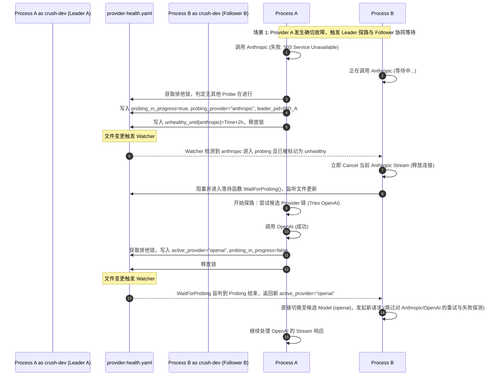

# Coordinated Provider Fallback Sequence Diagram (Single Leader Probing & Coordinated Waiting)

```mermaid
sequenceDiagram
    autonumber
    participant Process A as crush-dev (Leader A)
    participant File as provider-health.yaml
    participant Process B as crush-dev (Follower B)

    Note over Process A, Process B: 场景 1: Provider A 发生确切故障，触发 Leader 探路与 Follower 协同等待
    Process A->>Process A: 调用 Anthropic (失败: 503 Service Unavailable)
    Process B->>Process B: 正在调用 Anthropic (等待中...)
    
    Process A->>File: 获取排他锁，判定无其他 Probe 在进行
    Process A->>File: 写入 probing_in_progress=true, probing_provider="anthropic", leader_pid=PID_A
    Process A->>File: 写入 unhealthy_until[anthropic]=Time+2h，释放锁
    
    Note over File: 文件变更触发 Watcher
    File-->>Process B: Watcher 检测到 anthropic 进入 probing 且已被标记为 unhealthy
    Process B->>Process B: 立即 Cancel 当前 Anthropic Stream (释放连接)
    Process B->>File: 阻塞并进入等待函数 WaitForProbing()，监听文件更新
    
    Process A->>Process A: 开始探路：尝试候选 Provider 链 (Tries OpenAI)
    Process A->>Process A: 调用 OpenAI (成功)
    
    Process A->>File: 获取排他锁，写入 active_provider="openai", probing_in_progress=false
    Process A->>File: 释放锁
    
    Note over File: 文件变更触发 Watcher
    File-->>Process B: WaitForProbing 监听到 Probing 结束，返回新 active_provider="openai"
    Process B->>Process B: 直接切换至候选 Model (openai)，发起新请求 (跳过对 Anthropic/OpenAI 的重试与失败探测)
    Process A->>Process A: 继续处理 OpenAI 的 Stream 响应
```
